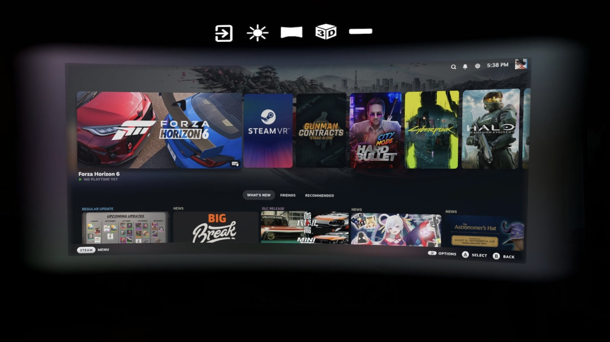

   
  
   
  <a href="https://ko-fi.com/moonlightxr">
    <strong>Support gilleece, the original Moonlight XR author, on Ko-fi</strong>
  </a>

# MoonlightXR Plus

A fork of [Moonlight XR](https://github.com/Gilleece/moonlight-android-xr) by **Sean Gilleece** — itself a fork of
[Moonlight for Android](https://github.com/moonlight-stream/moonlight-android) — which runs as a
native OpenXR application and shows the game stream in stereoscopic 3D on a headset. All credit
for the stereo/depth pipeline below, and the app itself, belongs to gilleece's original work;
please support it at the Ko-fi link above.

## About this fork

This fork is a quality-of-life pass over the original — it doesn't add performance or streaming
capability beyond what Moonlight XR already does, it just makes the existing VR experience nicer
to use day to day:

- A redesigned in-VR top bar (Exit, passthrough brightness, screen curvature, a live 3D-effect
  toggle, Ultra-Wide), with a screen-edge ambient glow that picks up colour from the streamed
  content itself, feathering softly into the screen's own edges instead of a hard cutoff
- Ultra-wide streaming mode — widens the requested stream resolution to a 21:9 picture. **Needs a
  matching ultra-wide source on the host to actually widen the field of view**: either a virtual
  display set to an ultra-wide resolution on the PC (with Sunshine/Apollo capturing that display),
  or an already-ultra-wide physical monitor being streamed. Without either, this just letterboxes
  the normal 16:9 picture into a wider frame rather than showing more of the screen.
- A rounded-card PC-select screen with favorites (hold a card for 2 seconds to pin it)
- An in-VR laser pointer restyled to match Quest's own system pointer more closely
- A number of smaller fixes found through actual on-headset testing — the detailed history is in
  [`docs/DEVLOG.md`](docs/DEVLOG.md)

Built and tested primarily on Quest 3.

## Screenshots

Ultra-wide mode, streaming Steam Big Picture, showing the rounded/feathered screen edge dissolving
into the ambient glow halo:

## Requirements

MoonlightXR Plus is a client — it needs a PC on the same network running a streaming host.
[**Apollo**](https://github.com/ClassicOldSong/Apollo) is the preferred host (more features, e.g.
better HDR/adaptive-sync support), but [Sunshine](https://github.com/LizardByte/Sunshine) works
too if that's what you already have set up. If you don't have either installed yet, follow the
setup instructions in whichever repo you pick before pairing this app with your PC.

## How the existing stereo/depth pipeline works

The stereo is generated entirely on the headset. A normal mono stream arrives from the PC exactly
as stock Moonlight receives it, a depth model runs on the frame, and a depth image based rendering
shader synthesises a separate view for each eye. Nothing on the PC side changes: no ReShade, no
stereo injector, no side by side transport, no Sunshine modifications. The host does not know it
is feeding a VR client, so this works with any Moonlight compatible host and any game, including
ones no depth buffer injector can reach.

On a headset the app starts in VR with the 3D effect already on, because the stock defaults make
it look broken on a virtual screen. Every part of it is a setting, and turning VR mode off gives
you stock Moonlight behaviour.

## Hardware

Built and tested on Pico 4 Ultra and Quest 3, both Snapdragon XR2 Gen 2, from one APK.

Quest 2, Quest Pro and Pico 4 are the previous generation with much less GPU headroom. They are
untested, and the depth model may be too expensive for them at any resolution.

## How it works

    decoder -> SurfaceTexture (external OES texture)
            -> downscale to 256x256, read back
            -> MiDaS small on the GPU, on its own thread
            -> depth upsampled to quarter resolution, guided by the colour frame
            -> occlusion aware gather warp, one view per eye
            -> two OpenXR quad layers, one per eye

Depth inference costs about 22 ms, which is longer than a display frame, so it runs on a separate
thread at a configurable cadence rather than inline. The warp costs about 2.8 ms of GPU time per
frame out of the 11.1 ms budget at 90 Hz.

## What to expect

This is an honest 3D effect, not a native stereo renderer, and it has limits worth knowing before
you build it:

- **Separation is deliberately conservative.** The default of 0.5 percent of frame width was
  chosen by measurement. Higher values were tested blind and produced no more perceived depth
  while causing eye strain and worse edge artifacts.
- **Silhouettes against high contrast backgrounds show some smearing.** A mono frame does not
  contain the pixels a second eye needs behind a foreground object, so that region is stretched.
  It is most visible on hard edges such as a hillside against bright sky, and largely invisible
  in ordinary content.
- **Depth lags the picture by roughly 50 ms.** The depth map is re-snapped onto each frame's
  colour edges, so this shows up as depth values being slightly stale rather than as misaligned
  edges.

## Controls

Quest Touch controllers and hand tracking both drive a laser pointer at the
screen — this is not gamepad input, an Xbox controller won't control the UI.
Trigger (or pinch) clicks, thumbstick scrolls, thumbstick click toggles the
pointer off entirely. It wakes on deliberate movement and retires after 9
seconds of stillness.

The screen can be grabbed and resized in place: hover under it for a drag bar,
hover a corner for a resize bracket, grip or trigger holds either one.
Position persists across sessions; recentring resets it.

A top bar above the screen has Exit, passthrough brightness (down to full
black), screen curvature, and a live 3D-effect toggle, all adjustable
mid-stream.

## Settings

**VR Settings**:

| Setting | Default | Notes |
| --- | --- | --- |
| Stream in VR | on | Immersive OpenXR session instead of a flat panel |
| Head locked screen | off | Screen follows your view rather than staying in the world |
| Screen distance | 3.0 m | |
| Screen width | 3.0 m | 3 m wide at 3 m away is about 53 degrees |
| Passthrough mode | off | Show your room behind the screen. Costs performance, turn it back off if the stream suffers. Also adjustable from the top bar's brightness slider while streaming |
| Realtime 3D mode | V1.0 - MiDaS Based 3D | "Off" streams flat, the rest are test patterns |
| Stereo separation | 0.5 % | Of frame width. Above about 0.5 the picture is not any deeper, only harder on the eyes |
| Screen curvature | 0 | 0 is flat, higher wraps the screen around you |

**VR Debugging**, which you should not need:

| Setting | Default | Notes |
| --- | --- | --- |
| Depth model cadence | 3 frames | Run the depth model on every Nth video frame |
| Show depth map | off | Renders the depth map as grayscale instead of the video |
| Swap eyes | off | |

The stream defaults also change on a headset, because the stock ones look bad on a virtual screen:

| Setting | Default |
| --- | --- |
| Resolution | 2560x1440 |
| Frame rate | 90 |

1440p is the default because 4K costs decode latency and host bitrate for a gain that is easy to
miss. 4K is there in the list if you want it, and is worth trying. 720p is unusable on a virtual
screen this size and 1080p is merely acceptable. Bitrate follows the resolution and frame rate as
it does upstream, so changing either resets it.

"Show performance stats while streaming" works inside the VR session and adds warp GPU time,
depth inference time, depth age and skipped depth frames to the usual figures.

## Building

Requires Android Studio with the NDK, and the submodules:

    git submodule update --init --recursive

Debug build:

    ./gradlew assembleNonRootDebug

The APK lands in `app/build/outputs/apk/nonRoot/debug/`. Install it with `adb install -r`.

### Release APK

The release build runs R8 and produces an unsigned APK, so it has to be signed before a headset
will install it. Create a keystore once:

    keytool -genkeypair -v -keystore release.keystore -alias moonlightxrplus \
        -keyalg RSA -keysize 2048 -validity 10000

Then build, align and sign:

    ./gradlew assembleNonRootRelease
    zipalign -f 4 \
        app/build/outputs/apk/nonRoot/release/app-nonRoot-release-unsigned.apk \
        moonlightxrplus-release.apk
    apksigner sign --ks release.keystore moonlightxrplus moonlightxrplus-release.apk
    apksigner verify moonlightxrplus-release.apk
    adb install -r moonlightxrplus-release.apk

`zipalign` and `apksigner` are in `$ANDROID_HOME/build-tools/<version>/`. The release build uses
the `.unofficial` application ID suffix that upstream asks forks to keep, so it installs alongside
a debug build and pairs with your host separately.

The APK is about 55 MB, most of which is the depth model and the LiteRT native libraries for four
ABIs. Only `arm64-v8a` is ever loaded on a headset; the other three are kept so the same build
still runs on phones.

## Licences

GPLv3, as upstream. Added dependencies are all compatible: the Khronos OpenXR loader (Apache 2.0),
LiteRT and its GPU delegate (Apache 2.0), and the MiDaS v2.1 small depth model (MIT), converted to
TensorFlow Lite by `tools/convert_midas.py` and committed as an asset.

The 360 degree environments are from [Poly Haven](https://polyhaven.com), released under CC0 and
downsized to 4096x2048 for this app. Poly Haven is community funded and worth supporting.

---

# Moonlight Android

[Moonlight for Android](https://moonlight-stream.org) is an open source client for NVIDIA GameStream and [Sunshine](https://github.com/LizardByte/Sunshine).

Moonlight for Android will allow you to stream your full collection of games from your Windows PC to your Android device,
whether in your own home or over the internet.

Moonlight also has a [PC client](https://github.com/moonlight-stream/moonlight-qt) and [iOS/tvOS client](https://github.com/moonlight-stream/moonlight-ios).

You can follow development on our [Discord server](https://moonlight-stream.org/discord) and help translate Moonlight into your language on [Weblate](https://hosted.weblate.org/projects/moonlight/moonlight-android/).

## Downloads
* [Google Play Store](https://play.google.com/store/apps/details?id=com.limelight)
* [Amazon App Store](https://www.amazon.com/gp/product/B00JK4MFN2)
* [F-Droid](https://f-droid.org/packages/com.limelight)
* [APK](https://github.com/moonlight-stream/moonlight-android/releases)

## Building
* Install Android Studio and the Android NDK
* Run ‘git submodule update --init --recursive’ from within moonlight-android/
* In moonlight-android/, create a file called ‘local.properties’. Add an ‘ndk.dir=’ property to the local.properties file and set it equal to your NDK directory.
* Build the APK using Android Studio or gradle

## Authors

* [Cameron Gutman](https://github.com/cgutman)  
* [Diego Waxemberg](https://github.com/dwaxemberg)  
* [Aaron Neyer](https://github.com/Aaronneyer)  
* [Andrew Hennessy](https://github.com/yetanothername)

Moonlight is the work of students at [Case Western](http://case.edu) and was
started as a project at [MHacks](http://mhacks.org).
